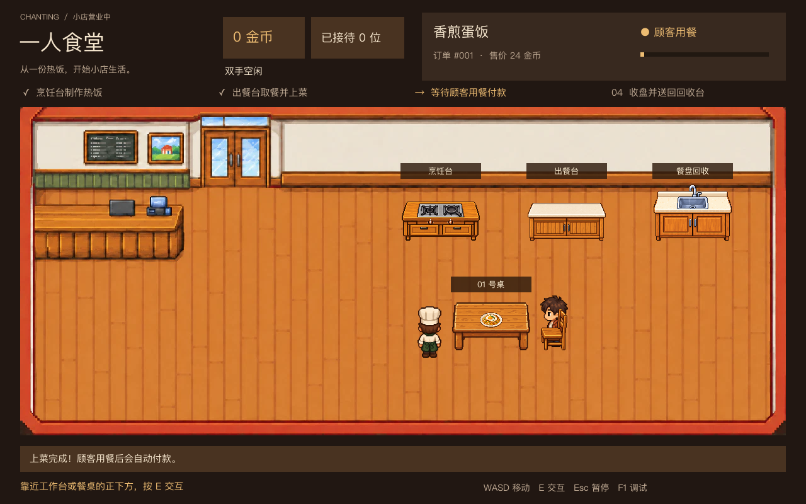

# 一人食堂 · Chanting

Godot 像素风餐厅经营游戏。当前为阶段一：单人、单桌、单菜品的完整服务原型。



## 运行

1. 使用 **Godot 4.7.1** 打开本目录的 `project.godot`。
2. 按 **F6** 仅运行当前场景，或按 **F5** 运行整个项目；首次打开建议直接 F5。
3. 顾客会自动入店、入座并点单，按右侧步骤完成服务。

项目使用 Compatibility 渲染器，无第三方插件或运行依赖。中文界面优先使用系统字体（macOS 苹方、Windows 微软雅黑、Linux Noto Sans CJK）；Linux 若中文缺字，请安装 `fonts-noto-cjk`。正式发行前需补充可分发字体。

## 操作

| 按键 | 功能 |
|---|---|
| WASD / 方向键 | 移动 |
| E / 空格 | 靠近工作台或餐桌正下方后交互 |
| Esc | 暂停 / 继续 |
| F1 | 开关调试信息 |
| N（调试模式） | 空桌时立即生成顾客 |
| R（调试模式） | 确认后重置本局 |

暂停菜单也可以重新开店。该操作会清空本局金币与订单；阶段一尚无存档。

## 服务流程

顾客自动点单 → 烹饪台制作 → 出餐台取餐 → 餐桌下方上菜 → 顾客用餐并自动付款 → 顾客离店 → 收盘 → 回收台交付 → 迎接下一位顾客。

- 菜品为香煎蛋饭，每单 18 金币，食材暂时无限。
- 烹饪约 2.8 秒，制作时主角暂停移动；用餐约 4 秒。
- 手里只能拿一件物品；端起的食物可以放回出餐台。
- 餐盘送到回收台后，桌子才会恢复可用。
- 收盘完成后自动接待下一位顾客。

## 已实现范围

- 用户提供的餐厅背景与 imagegen 生成的像素图片：主角、顾客、家具和餐食；单图均小于 400KB。
- 主角移动、方向表现、墙体和家具碰撞、距离交互与手持物品。
- 顾客进店、入座、点单、用餐、付款和离店。
- 独立订单状态、稳定任务标识，以及做菜、上菜、收盘工作接口。
- 金币、订单状态、步骤提示、进度条、暂停、确认重置和调试入口。
- 10 轮服务规则回归测试，以及实际场景集成测试。

多顾客、耐心、地面清洁、烹饪小游戏、员工、采购、升级与存档留在后续阶段。

## 代码结构

```text
scenes/restaurant.tscn       项目入口
scripts/service_model.gd    服务规则、订单、工作任务、物品与结算
scripts/restaurant.gd       餐厅布置、交互、界面与角色协调
scripts/player.gd           主角移动与碰撞
scripts/customer.gd         单桌顾客固定路线与进出店行为
scripts/avatar.gd           图片动画与手持物显示
scripts/station.gd          家具交互与台面物品
scenes/actors/             主角、顾客和可替换头像场景
scenes/furniture/          可独立摆放的家具场景
assets/                   压缩后的背景、角色、家具与物品图片
scripts/pause_input.gd      暂停状态下仍可使用的输入
tests/                     规则、场景测试与实际画面预览
docs/                      开发计划、状态规则和阶段验收
```

阶段一采用单桌固定路线，不包含通用寻路或员工调度。`ServiceModel` 不依赖场景，可以在后续阶段继续扩展；正式员工任务领取机制在阶段三实现。

## 测试

将 Godot 命令加入环境后，在项目目录运行：

```sh
godot --headless --path . --editor --import --quit
godot --headless --path . --script tests/test_service_model.gd
godot --headless --path . --script tests/test_scene.gd
godot --headless --path . --script tests/test_assets.gd
```

macOS 可将 `godot` 替换为 `/Applications/Godot.app/Contents/MacOS/Godot`。

生成实际游戏画面（需要图形环境）：

```sh
godot --path . --script tests/capture_preview.gd
```

输出烹饪、搬运、上菜三张预览到 `test-results/`，并更新文档配图 `docs/image-assets-preview.webp`。GitHub Actions 对推送与拉取请求自动运行项目导入和三组测试，不包含可执行安装包导出。

## 分支约定

- `main`：初始 Godot 项目基线。
- `feature/stage-1-service-loop`：阶段一服务原型。
- `feature/image-assets`：当前图片素材替换与场景拆分。
- 每个后续阶段从已验收的代码新建开发分支，完成验证后再合并。
- `.godot/`、构建输出和测试临时结果不进入仓库；Godot 的 `.uid` 文件进入仓库。

本次本地提交使用仓库级身份 `Codex <codex@localhost>`，未修改电脑的全局 Git 身份设置。可在后续提交前改为项目维护者的 Git 身份。

详见 [阶段一验收记录](docs/stage-1.md) 和 [完整分阶段开发计划](docs/development-plan.md)。

图片尺寸规范、家具替换方法及原图内置收银台的限制，详见 [图片素材与替换说明](docs/image-assets.md)。
