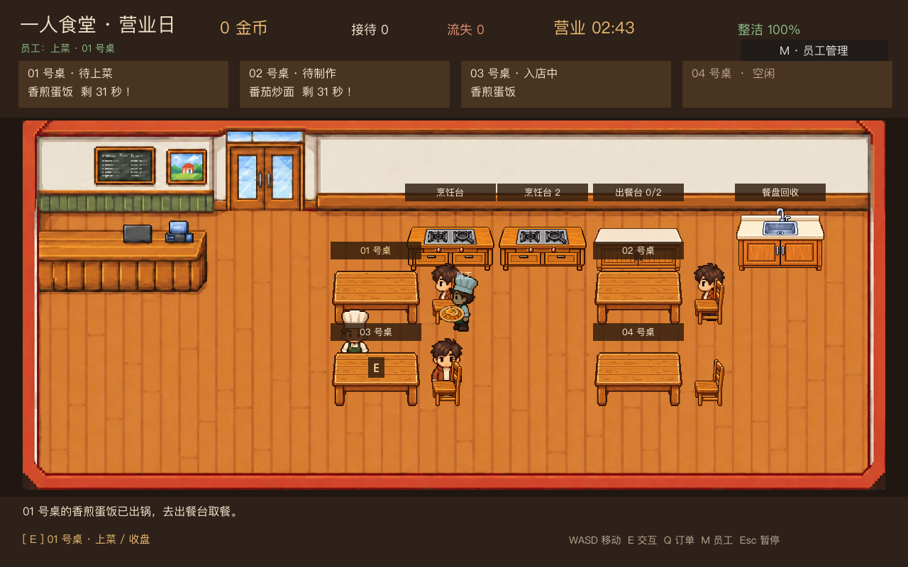
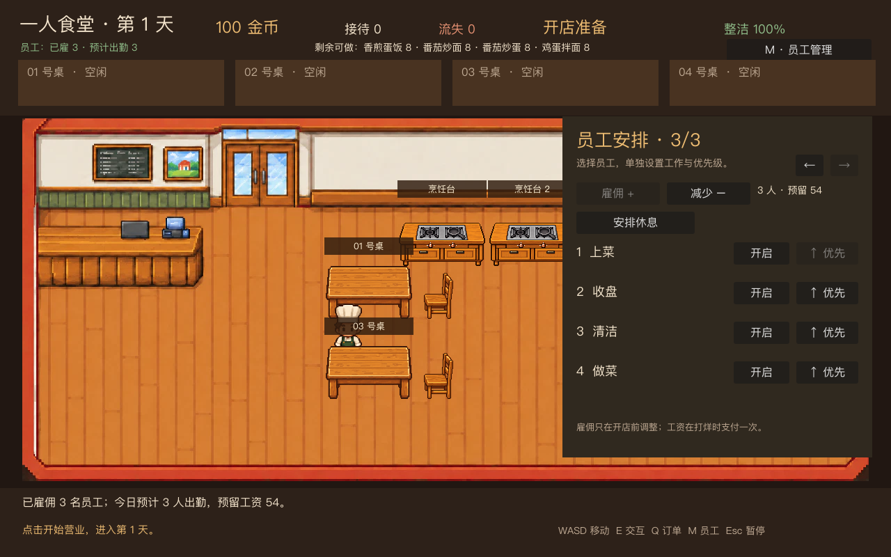

# 一人食堂 · Chanting

Godot 像素风餐厅经营游戏。已实现最多五桌营业、四道菜、独立烹饪小游戏、多员工协作与工资，以及跨日经营、食材采购、菜单定价、家具布置和设备升级。



## 运行

使用 Godot 4.7.1 打开 `project.godot`，按 F5 运行。项目使用 Compatibility 渲染器，无第三方插件。中文界面优先使用系统字体（macOS 苹方、Windows 微软雅黑、Linux Noto Sans CJK）。

## 操作

| 按键 | 功能 |
|---|---|
| WASD / 方向键 | 移动 |
| E / 空格 | 靠近工作台、餐桌或污渍交互 |
| Q | 切换待做订单；当前订单带 `▶` 标识 |
| M | 打开员工管理，调整工作开关和优先级 |
| Esc | 暂停 / 继续 |
| F1 | 开关调试信息；调试模式下 N 生成顾客、R 重新开店 |

游戏从“开店准备”开始。可先打开“采购与菜单”对照四道菜的每份用料购买食材、调整在售菜品和售价；点击“开始营业”后才会接待顾客。靠近烹饪台按 E 进入独立小游戏。小游戏中按住空格加热，松开降温，在翻炒游标的绿色区按 F，熟度达到 80 后按 E 出锅；B 可返回餐厅并保留订单。更高的品质会增加付款金额。

## 员工协作

新游戏开局尚未雇佣员工。开店前按 M 打开人员安排，最多可雇佣 3 名员工，每人日薪 18 金币。雇佣后按可负担人数预留当天工资，采购只能花剩余金额；打烊时按实际出勤人数支付一次。资金不足时，部分员工不出勤，主角仍可独自工作。管理面板可切换员工，分别安排工作与优先级。店内有两个可独立使用的烹饪台，主角与出勤员工可以同时做菜，其他员工也可并行上菜、收盘和清洁。员工出发前会预留任务；在员工到达并开始执行前，主角可直接接手。员工已开始做菜、拿起菜品或收走餐盘后，任务由员工完成。员工之间不能重复领取同一任务，每个人独立携带菜品或餐盘。顶部显示各出勤员工的工作状态，管理面板显示所选员工的具体状态。按 M 打开管理面板，关闭某项工作或调整优先级；设置在下一营业日继续生效。禁用整名员工后，主角仍可独立完成营业日。员工空闲时会在当前位置附近慢速走动，接到任务后立即恢复正常工作速度。



## 营业规则

- 初始四张桌子，可购买第五张；各桌有独立订单与耐心。顶部订单卡显示菜品、状态和剩余秒数；不足 12 秒会变红。
- 营业画面顶部持续显示四道菜当前还可制作的份数；已被订单预留的食材不计入可用量。
- 菜品为香煎蛋饭、番茄炒面、番茄炒蛋和鸡蛋拌面。每道菜的原料、建议售价、今日售价和可制作份数都在“采购与菜单”中展示。
- 新游戏有 60 金币启动资金，每种食材各 8 份。顾客下单时预留原料，开火时消耗。每位顾客按个人偏好和售价排列三道候选菜，依次判断是否购买；改选会降低满意度。三道都不买时，顾客仍会进店短暂停留并显示省略号，然后离开。无可售菜品时不能开店。没有可做的菜且买不起所缺食材时，每天可领取一次应急蛋饭食材。
- 出餐台最多放两份菜；做菜开工时会预留出餐位置。每个角色一次只能拿一件物品。把菜送错桌会提示，食物不会丢失。
- 顾客等餐超时会离店；制作中、出餐台和手中的失效食物会清理，不会长期占用炉灶或角色。
- 顾客用餐后付款、评价并离店。靠近桌子收盘，送到回收台，桌子恢复可用；地面出现污渍时，空手靠近按 E 清洁。
- 营业 180 秒，随后停止接待新顾客，并给 35 秒收尾。日结显示日初现金、营业收入、采购等支出、日末现金、食材消耗成本估计，以及接待、评价和员工完成工作数；未购买离开的顾客按其第一选择统计缺货或停售的菜，售价/口味造成的未成交单列。
- 开店前可自由摆放所有餐桌与座椅、两处烹饪台、出餐台和餐盘回收台，也可购买第五张餐桌；烹饪设备升级使主角与员工的制作速度提高 25%。布局和升级跨日保留。详见 [阶段 4.5 实现说明](docs/stage-4-5.md)。
- 点击“准备下一营业日”会保留金币、天数和员工安排，并清空当天的订单与任务；“新游戏”经确认后清空全部进度。目前尚未写入磁盘，退出程序后进度不会保留，本地存档暂缓，留待阶段 4.4。

## 图片和代码

用户提供的餐厅背景与已生成角色、家具、食物图片独立于规则；单张图片均小于 400KB。员工暂用着色的厨师图片，烹饪锅与地面污渍暂用像素绘制，后续可换图。

- `scripts/day_model.gd`：并行订单、耐心、桌位、统一任务预留、物品交接、付款和日结。
- `scripts/employee.gd`：员工调度、障碍寻路、四类自动工作和异常恢复。
- `scripts/layout_rules.gd`：家具占地、通路检查和顾客到餐桌的动态路线。
- `scripts/restaurant.gd`：场景、交互、界面与各角色协调。
- `scenes/cooking/`、`scripts/cooking/`：独立做菜界面、规则与临时像素表现。
- `scenes/furniture/`、`scenes/actors/`：可独立替换的家具和角色场景。
- `scripts/service_model.gd`：保留阶段一单桌服务规则作为历史回归样本；当前游戏使用 `DayModel`。

详见 [阶段 4.5 家具与设备说明](docs/stage-4-5.md)、[多员工并行经营说明](docs/multi-employee.md)、[完整开发计划](docs/development-plan.md)、[阶段 4.3 实现说明](docs/stage-4-3.md)、[阶段 4.2 实现说明](docs/stage-4-2.md)、[阶段 4.1 实现说明](docs/stage-4-1.md)、[烹饪小游戏说明](docs/cooking-minigame.md) 与 [图片替换说明](docs/image-assets.md)。

## 验证

```sh
godot --headless --path . --editor --import --quit
godot --headless --path . --script tests/test_service_model.gd
godot --headless --path . --script tests/test_day_model.gd
godot --headless --path . --script tests/test_scene.gd
godot --headless --path . --script tests/test_assets.gd
godot --headless --path . --script tests/test_cooking_model.gd
godot --headless --path . --script tests/test_cooking_screen.gd
godot --headless --path . --script tests/test_employee_model.gd
godot --headless --path . --script tests/test_employee.gd
godot --headless --path . --script tests/test_employee_comparison.gd
godot --headless --path . --script tests/test_multi_day.gd
godot --headless --path . --script tests/test_inventory.gd
godot --headless --path . --script tests/test_customer_choice.gd
godot --headless --path . --script tests/test_payroll.gd
godot --headless --path . --script tests/test_multi_employee.gd
godot --headless --path . --script tests/test_layout_equipment.gd
```

macOS 可将 `godot` 替换为 `/Applications/Godot.app/Contents/MacOS/Godot`。图形环境下运行 `godot --path . --script tests/capture_stage_4_5.gd` 可重新生成家具布置与设备升级画面。GitHub Actions 对 `main` 的推送自动运行十五组测试。

## 分支

`main` 是日常开发主分支；之前的 `feature/` 分支保留为阶段历史。除非明确需要隔离开发，后续直接提交和推送到 `main`。
