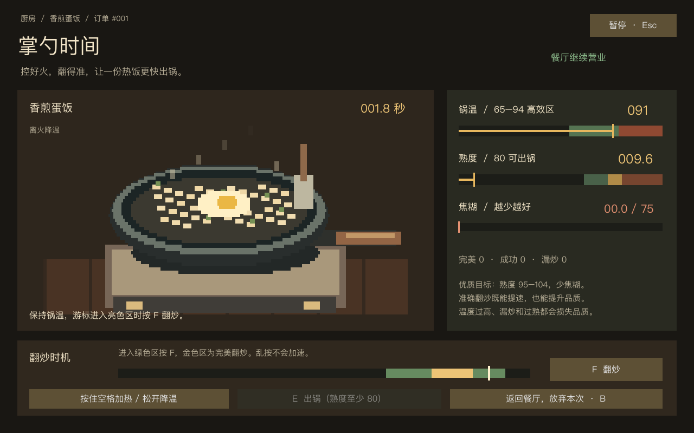

# 阶段二 · 烹饪小游戏第一版

小游戏是阶段二营业日的一部分，支持四桌订单和两道菜。员工系统属于阶段三。

## 进入与操作

顾客点单后，使用 Q 选中待做订单，再走到烹饪台下方按 E，进入独立全屏界面。准备界面按空格开始计时。

| 操作 | 效果 |
|---|---|
| 按住空格 | 加热，熟度增长加快 |
| 松开空格 | 降温，避免烧焦 |
| F | 游标进入绿色区时翻炒，金色区判定完美 |
| E | 熟度至少 80 时出锅；结果界面确认返回，失败时重做 |
| B | 放弃本次，返回餐厅，保留顾客订单 |
| Esc | 暂停 / 继续 |

按钮也支持鼠标操作。失去窗口焦点会暂停进行中的烹饪；暂停清除持续加热，恢复后需重新按住空格。

返回餐厅后，仍需到出餐台取餐，再给对应餐桌上菜。金币只在顾客付款时发放一次。小游戏期间餐厅时间和其他订单的耐心继续推进，界面上方显示四桌状态，主角禁止移动；暂停菜单则冻结全部游戏。若本单顾客等餐超时，小游戏自动关闭并释放炉灶。

## 速度与完成度

- 锅温 65–94 是推荐工作区。超过 94 开始累积焦糊；极高温可以加快熟度，但风险更大。
- 成功翻炒增加 8 熟度并降温 6；完美翻炒增加 12 熟度并降温 9。
- 翻炒绿色区为进度 65%–94%，完美区为 76%–86%。乱按增加焦糊且重置游标；漏炒也增加焦糊。
- 熟度 80 可以提前出锅，95–104 为最佳区间，目标中心为 98；过熟扣分并逐渐增加焦糊。
- 评分综合熟度、翻炒准确度、焦糊和过熟。高品质额外奖励 2 金币；85 分以上且熟度 95–104、焦糊不超过 12 时，奖励 6 金币。
- 焦糊达到 75 失败；单局上限 45 秒，达到最低熟度则自动出锅并扣分，否则失败。
- 食材当前无限，失败或放弃没有材料消耗，可重新尝试。

自动模拟操作的初始平衡结果：熟练策略约 6.9 秒 / 100 分，保守策略约 11.4 秒 / 86 分，提前出锅约 6.1 秒 / 70 分。连续乱按示例仅 13 分。这些是规则测试结果，实际玩家体验仍需试玩调参。

## 图片替换接口

- `scripts/cooking/cooking_model.gd`：纯烹饪规则，不依赖场景或素材。
- `scenes/cooking/cooking_screen.tscn`、`scripts/cooking/cooking_screen.gd`：独立界面和输入。
- `scripts/cooking/pan_visual.gd`：锅、食物、炉火和翻炒的像素绘制，后续可替换成 Sprite2D / AnimatedSprite2D。
- `scripts/cooking/cooking_meter.gd`：进度条绘制，不包含玩法判定。

替换 PanVisual 时保留 `cooking`、`heating`、`toss` 三个表现接口，或在新的表现脚本中适配，烹饪评分和餐厅服务不必修改。本版无新增游戏位图依赖，文档截图压缩为 WebP。

## 验证

五组自动检查覆盖烹饪边界与帧率一致性、十轮服务、场景碰撞、图片资源，以及实际键盘输入下的进出小游戏、暂停、取消、重试和重置。使用真实 Godot 渲染检查烹饪及结果界面。

订单和每次烹饪各有独立标识；放弃、重试、重置后的过期结果无法生成食物或重复结算。
