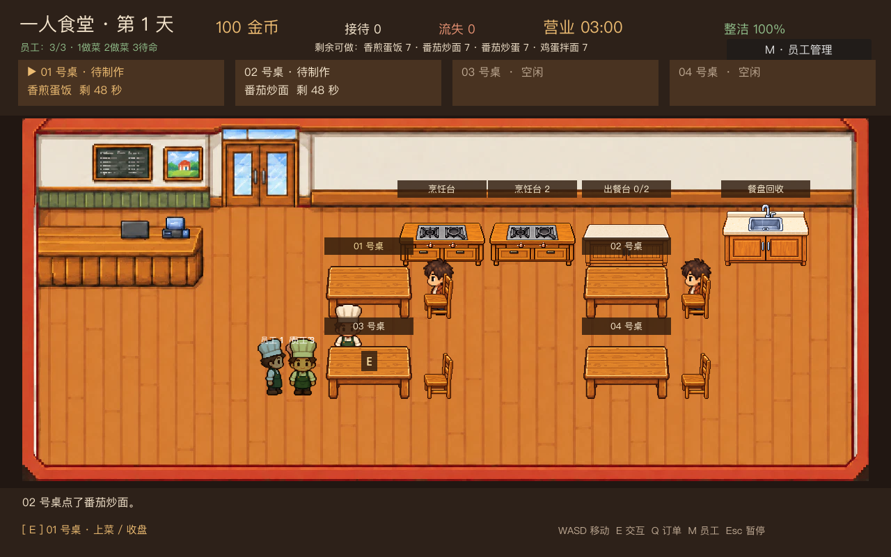

# 多员工雇佣与并行经营

开店前最多可雇佣 3 名员工；管理面板的“雇佣 + / 减少 −”调整人数，左右按钮选择员工，分别设置工作开关、任务优先级与休息状态。员工各有独立角色、站位和任务状态。

每人日薪 18 金币。开店前按当前现金为可负担的员工预留工资；例如经营中现金只有 30、雇佣 3 人时，预留 18，今日只有 1 人出勤，剩余 12 可用于采购。后续营业日资金充足时，其他已雇员工自动恢复出勤。打烊只支付实际出勤人数的工资。

营业时，多名员工可同时领取不同任务。两个炉灶最多同时做两道菜；上菜、收盘和清洁也按订单或污渍独立预留。每名员工单独保存手中菜品或餐盘，互不覆盖；主角仍可接手员工尚未开始的任务。

`tests/test_multi_employee.gd` 覆盖人数上限、部分出勤与工资、双炉灶、并行上菜收盘、独立携物和失效食物回收、主角接手第二名员工、不同员工的工作设置，以及三人自动完成一个完整营业日。两张图片均由 `tests/capture_multi_employee.gd` 从游戏实际渲染生成，单张低于 400KB。
