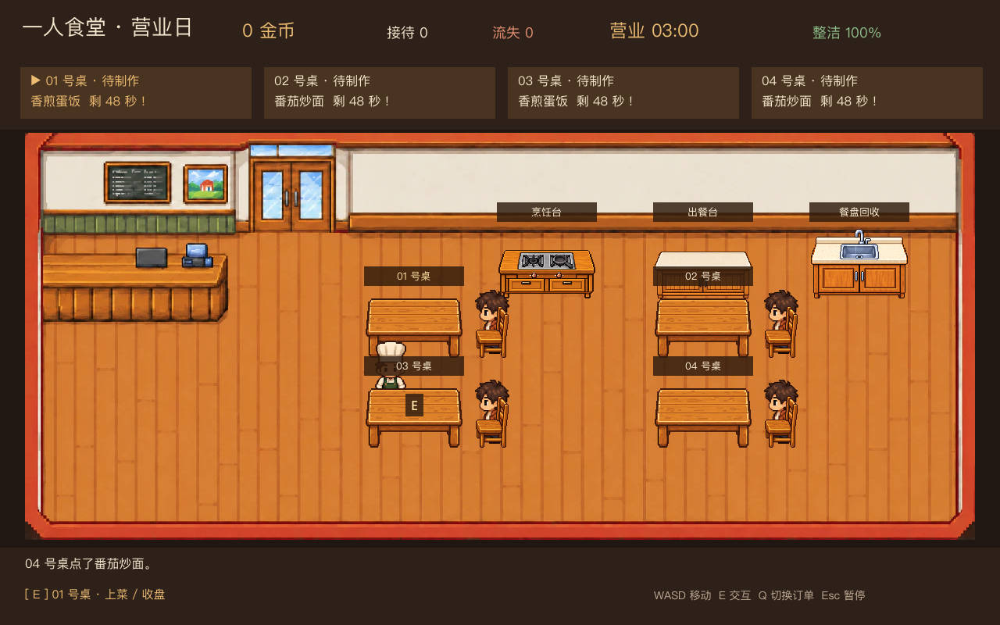
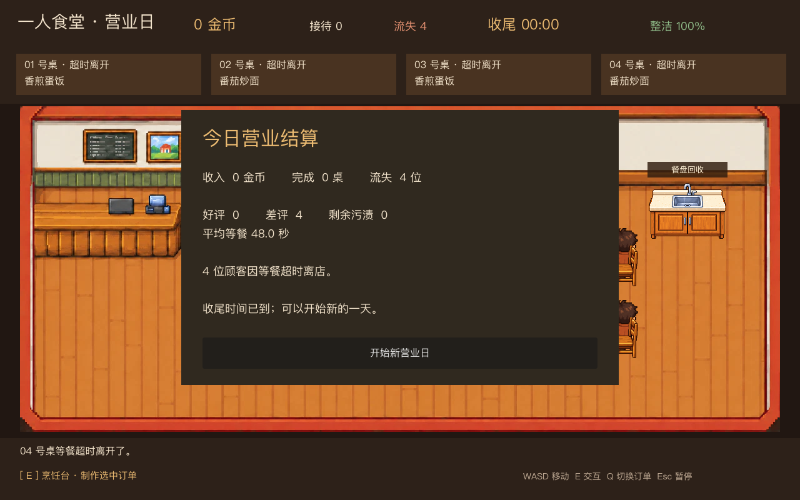

# 阶段二验收：完整手动营业日

阶段二在阶段一服务闭环上加入四桌并行、营业压力、第二道菜、地面清洁、顾客评价和日结。已实现计划第 6 节的十项工作，尚未加入阶段三员工系统。

## 一局的流程

顾客按低峰或高峰节奏到店，每张空桌只分配一位顾客。顶部四张订单卡展示状态、菜品与剩余耐心；不足 12 秒会变红。按 Q 切换待做订单，靠近烹饪台按 E 进入对应菜品的小游戏。做好的菜占用唯一出餐位，需取走并送到正确餐桌。顾客用餐、付款、评价后离店；玩家收盘并回收餐盘，桌位重新可用。每完成两桌出现一处污渍；空手靠近污渍按 E 清洁。污渍上限三处。

营业到 180 秒后停止接待新顾客，并给 35 秒收尾；若所有工作提前清完，立即进入日结。收尾期结束后强制结算。日结显示收入、完成桌数、等餐流失、好差评、剩余污渍及平均等餐时间，并明确说明流失原因。

## 首轮节奏参数

| 参数 | 第一版数值 | 作用 |
|---|---:|---|
| 餐桌 / 最大占用 | 4 | 避免同桌重复占座 |
| 低峰到店间隔 | 14 秒 | 允许完成日常工作 |
| 高峰到店间隔 | 8 秒 | 制造排队压力 |
| 波次 | 每 70 秒中第 25–55 秒为高峰 | 固定、可复现 |
| 等餐耐心 | 48 秒 | 制作、取餐、上菜共用 |
| 危急提醒 | 剩余 12 秒 | 订单卡变红 |
| 用餐时间 | 4 秒 | 完成后付款与评价 |
| 营业 / 收尾 | 180 / 35 秒 | 正常完成或强制日结 |
| 污渍上限 | 3 | 防止无限堆积 |
| 蛋饭 / 炒面 | 18 / 24 金币 | 炒面烹饪进度为蛋饭的 82% |

参数集中在 `scripts/day_model.gd` 的常量与 `RECIPES` 配置中。客流与污渍生成使用固定规则，便于下一轮真实试玩调参。评价先反馈原因，不直接改变后续客流。差评原因依次检查等餐较久、菜品品质和整洁度；超时离店记录“等餐超时”。

## 异常处理与验收

- 顾客在待制作、制作中、待取餐、手持待上菜期间超时，订单进入离店流程。对应炉灶、出餐位和手中食物立即释放；小游戏自动关闭。
- 订单和每次烹饪使用独立递增标识。取消、重做、超时和重置后的旧结果不能进入新订单。
- 只有正确餐桌能收下该菜，顾客付款只发生一次；不接收重复完成的烹饪结果。
- 暂停冻结营业时间、顾客耐心和小游戏，继续后不会保持按住空格的加热状态。
- 正常提前完成与收尾超时均显示日结；日结可开始新营业日。

自动测试覆盖四桌预留、订单选择、两道菜结算、失效资源回收、清洁、评价、正常和超时日结，以及真实场景操作。实机渲染确认四桌餐厅、小游戏与日结界面。首轮数值是可玩的初始值，尚需玩家试玩检验难度。
