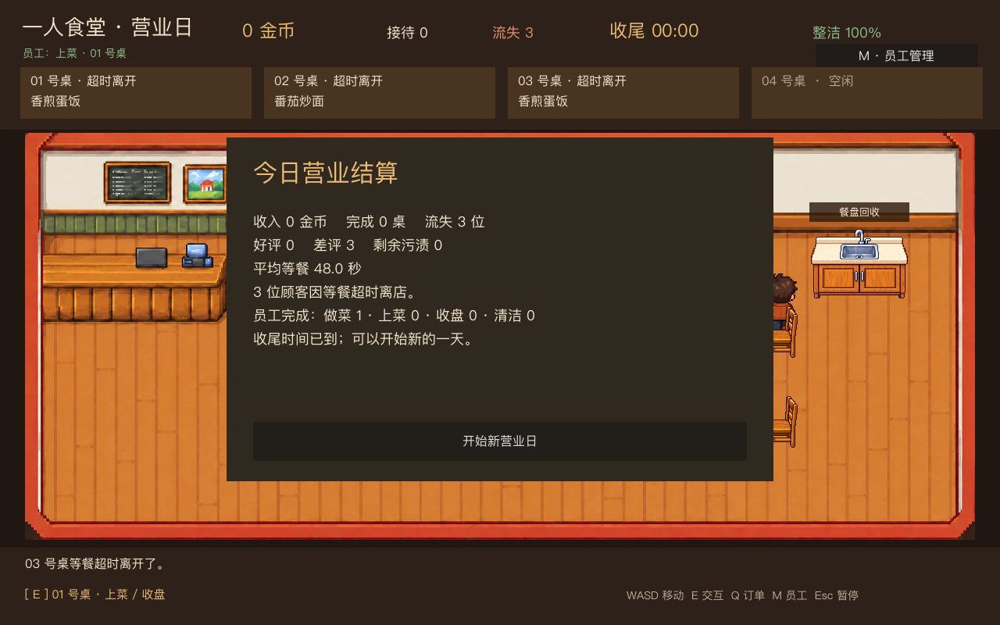

# 阶段三验收：首位员工与玩家协作

阶段三实现了一名可自动工作的员工。他与主角共用 `DayModel` 的任务预留、物品交接和结果结算；做菜也调用与玩家相同的烹饪规则。正式雇佣、工资和库存仍按原计划留到阶段四。

## 玩家可操作内容

游戏开始时员工就在店里工作。顶部状态栏显示当前任务；按 M 或点击“员工管理”可以调整整名员工启用或休息、分别开启或关闭上菜/收盘/清洁/做菜，以及点击“↑ 优先”把某类工作上移一位。默认顺序是上菜、收盘、清洁、做菜。

设置只影响新任务；正在搬运的食物和餐盘会先送达。主角可接手员工尚在前往目标地点的任务；员工已开始制作或拿起物品后，主角改做其他工作。日结显示员工各类工作完成数。

## 任务与资源规则

员工领取任务时先预留，再开始走路；员工之间的预留互斥，主角优先级更高，可覆盖员工尚未开工的预留。两个烹饪台可独立做菜，出餐台最多容纳两份菜；烹饪开工前预留对应的出餐容量，避免出锅时无处放菜。员工拿到食物后走到对应餐桌；收盘后把餐盘送回回收台；清洁时走到对应污渍旁。做菜使用同一 `CookingModel`，不同菜品保留各自烹饪速度和品质结算。

员工在约 20 像素的网格上绕开墙、收银台、炉灶、桌椅等静态障碍。目标位置不在可达区域时显示“路径不可达”，释放任务并尝试别的工作。订单超时会释放其预留；若员工已端着失效菜品，会先送至回收台。路径仍不可达时，会安全移除失效物品，不会一直占住双手。被取消的收盘任务恢复为待收盘状态；出餐失败时，食物回到空闲出餐位，避免遗失。

## 验证与首轮评估

- 规则测试覆盖双炉灶同时做菜、两份菜出餐、主角接手员工路上的做菜/上菜/收盘/清洁任务、员工已开工后的独占、超时餐食回收、任务中断恢复和旧订单失效。
- 场景测试覆盖四类自动工作、任务关闭与优先级、工作中修改设置、不可达目标以及连续三个营业日；三个模拟日各接待 6 桌，均正常日结且没有残留任务预留。
- 固定客流和相同脚本化主角操作下，纯手动完成 **7 桌、流失 4 位、主角操作 50 次**；员工协作完成 **13 桌、流失 0 位、主角操作 45 次，员工完成 22 项工作**。这只是可复现的规则与节奏对比，不代表真人试玩成绩，实际游戏体验仍需进一步调参。

所有新预览图均使用压缩 WebP，单张小于 400KB；员工暂用现有厨师图片着色区分，后续可直接替换其 `Avatar` 场景图片。
