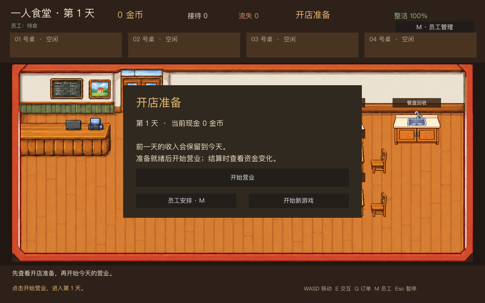
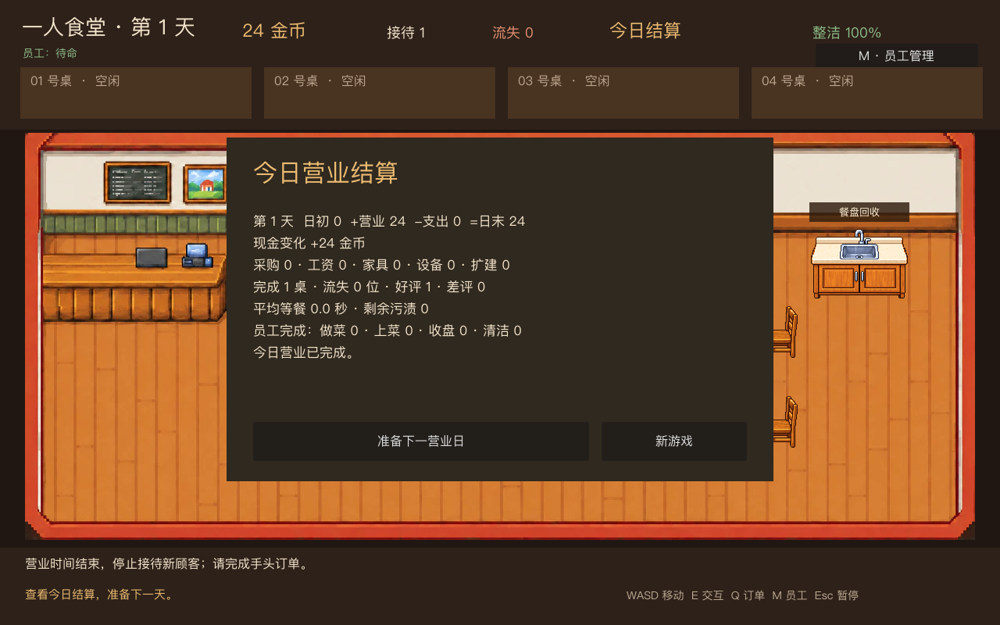

# 阶段 4.1：跨日经营骨架

这一版把原先每局清零的单日试玩改成连续营业日。游戏启动时先进入开店准备；玩家点击“开始营业”后，顾客、营业计时和员工工作才开始。打烊结算后可以准备下一日，现金与员工工作设置保留，订单、污渍、物品占用和当天统计清空。“新游戏”会在确认后重置全部进度。

## 资金与日结

顾客付款现在通过 `DayModel` 的统一交易入口入账。账本按营业日记录交易类别、带正负号的金额和交易标识；同一营业日的同一标识不能重复入账，支出不能使余额为负。已预留采购、工资、家具、设备、扩建五类支出接口，本版尚没有对应的购买按钮。

日结展示日初现金、营业收入、各类支出、日末现金与现金变化，并保留服务数、评价、平均等餐和员工工作统计。结算只发生一次；在日结界面发生的后续合法支出也会更新当日历史报表。下一日从上日末现金开始记录新账本。

## 状态边界

- `preopen`：时钟不走、不生成顾客、主角不能使用工作台；可以查看员工安排。
- `open`：沿用阶段三的服务、做菜、员工任务与收尾流程；营业中不开放管理类支出。
- `summary`：停止营业，保存当天报表；下一日按钮只能执行一次。

订单和烹饪尝试编号跨日保持递增，避免上一日的延迟回调误写到新订单。员工工作开关和优先级跨日保留，员工当天完成数在下一日归零。新游戏恢复员工默认设置。

## 验证与后续

`tests/test_multi_day.gd` 覆盖开店前时间冻结、两日收入累计、交易幂等、余额不足、跨日清场、报表分日、员工设置保留和新游戏重置；原有服务、做菜、员工及场景测试继续运行。实际画面通过 `tests/capture_stage_4_1.gd` 渲染，两张 WebP 均小于 400KB。

本版仍使用无限食材、默认在场的员工，且进度只保留在当前运行会话中。采购与菜单、正式雇佣和本地存档分别在 4.2、4.3、4.4 接入；它们将使用本版的资金与跨日接口。
