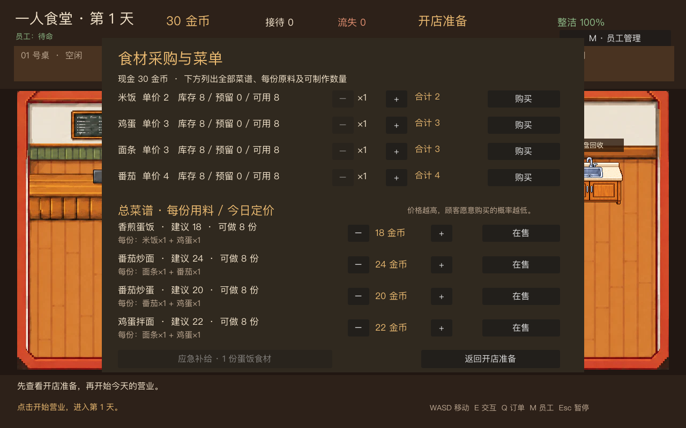
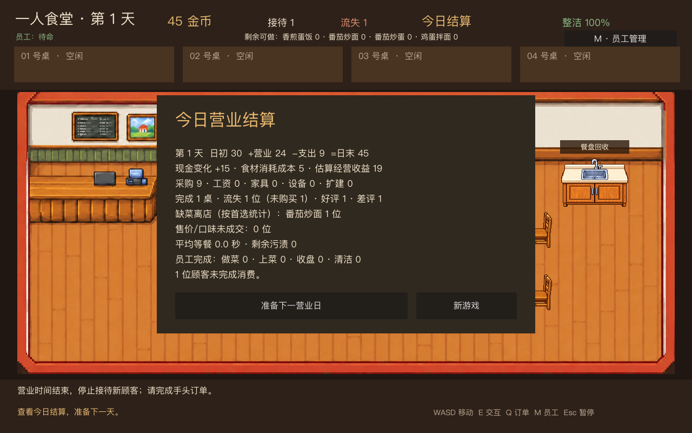

# 阶段 4.2：食材采购与菜单

开店准备界面新增“采购与菜单”。玩家可按食材查看单价、库存、已预留、可用量，选择 1～20 份并购买；购买立即从阶段 4.1 账本扣款。界面还显示两道菜当前可制作的份数，可在开店前决定是否出售。营业中不能采购或改菜单。

## 第一版经济参数

| 食材 | 单价 | 新游戏库存 | 用于菜品 |
|---|---:|---:|---|
| 米饭 | 2 | 8 | 香煎蛋饭 ×1 |
| 鸡蛋 | 3 | 8 | 香煎蛋饭 ×1 |
| 面条 | 3 | 8 | 番茄炒面 ×1 |
| 番茄 | 4 | 8 | 番茄炒面 ×1 |

新游戏另有 30 金币启动资金。蛋饭售价 18、食材成本估计 5；炒面售价 24、食材成本估计 7。品质加成仍按小游戏结果计算。这组数值先保证已有营业日可正常试玩；正式工资和扩建费用加入后再统一调优。

## 订单与库存规则

- 顾客生成订单时，只从**在售且食材可预留**的菜品中选择；原本轮到的菜缺货时尝试另一道。没有可履约菜品时不生成顾客，也不会占桌或透支库存。
- 订单进入餐厅时一次性预留该菜所需的全部食材。员工领取任务、主角接手员工预约任务都不会再次预留。
- 主角或员工真正开始做菜时，食材从库存扣除并解除预留；同一次开工不会重复扣料。取消后重做属于新的开工，会再次消耗食材。
- 开工前订单取消或超时会释放预留、保留库存。开工后取消或超时不返还已消耗的食材；取消后仅在还有可用食材时为重做重新预留。
- 至少保持一道菜在售。开店前若所有在售菜都无法制作，开始营业会被拒绝并提示采购、调整菜单或领取应急补给。
- 如果没有任何可制作的菜，且现金不足以买齐任一道菜所缺的食材，每个营业日可领取一次免费的蛋饭食材。领取后自动使蛋饭在售；这份食材仍需预留和消耗。

库存、菜单与剩余食材跨营业日保留；当天订单预留在离店、取消或打烊清场时释放。食材采购是现金流出，食材消耗成本则是经营收益估计的一部分，日结分别展示，避免把囤货误判为当日亏损。

## 验证

`tests/test_inventory.gd` 覆盖采购付款与失败回滚、菜单停售、并发订单防超卖、员工预约与主角接手、开工前后取消、超时释放、跨日库存保留、应急补给及实际采购按钮。其他十组 Godot 回归测试继续运行。两张预览图均由 `tests/capture_stage_4_2.gd` 从游戏实际渲染生成，单张小于 400KB。

本版仍默认有一名员工，不扣工资；正式雇佣、工资预留及经营收益调优在 4.3 实现。
