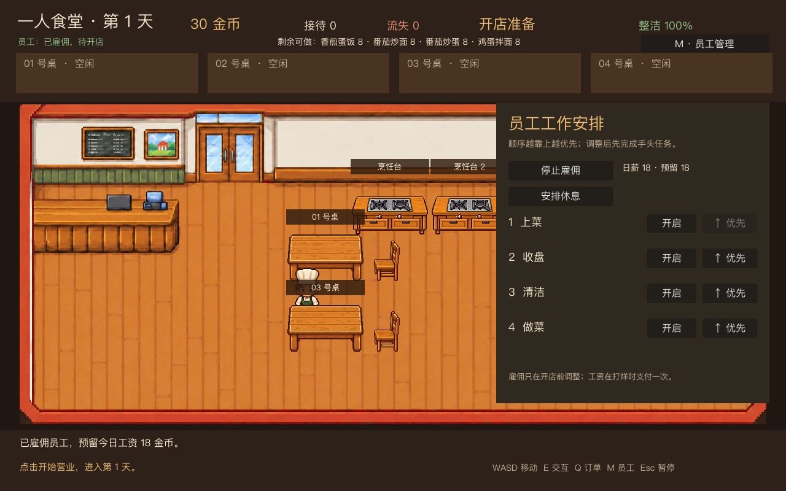
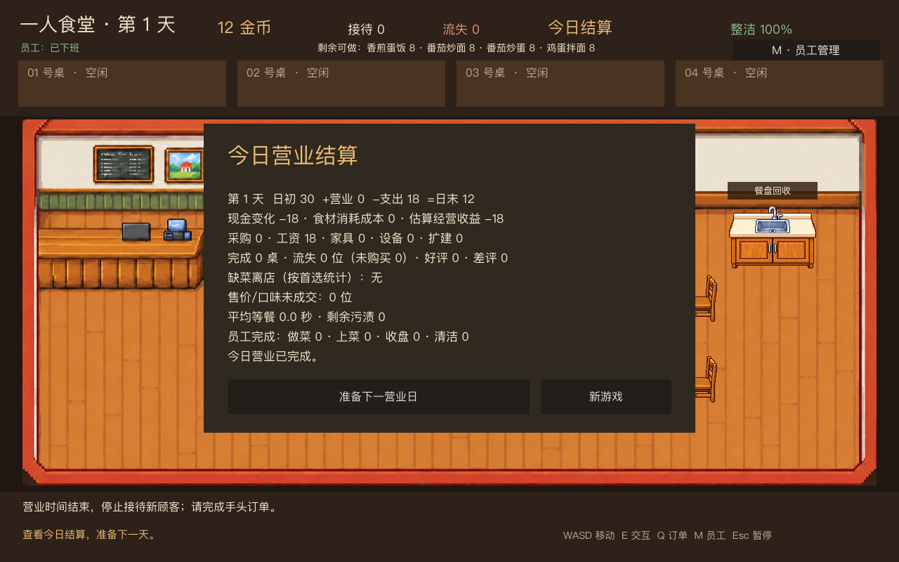

# 阶段 4.3：雇佣与工资

新游戏不再默认雇佣员工。开店前按 M 进入人员安排，可雇佣或停止雇佣一名员工；营业开始后不能变更雇佣关系。员工每天工资为 18 金币，工作类型开关和优先级继续跨日保留。

## 工资规则

- 雇佣时不立即扣款。开店准备阶段为已雇员工预留当天工资，采购与其他准备阶段支出只能使用扣除预留工资后的现金。停止雇佣会立即释放预留。
- 开始营业时确定当天是否出勤。若现金不足 18 金币，雇佣关系仍保留，但员工不出现、不接任务；玩家可以独自经营。下一个营业日现金充足时，已雇员工自动恢复出勤。
- 出勤员工的工资在打烊时通过经营账本扣除，且每个营业日只支付一次。员工休息或当天没有任务也照常支付日薪。未出勤的营业日不扣工资。
- 日结同时显示工资支出、食材消耗成本与估算经营收益。下一营业日重新预留工资；新游戏清空雇佣状态。

## 验证

`tests/test_payroll.gd` 覆盖雇佣幂等、工资预留、采购资金边界、停止雇佣释放预留、打烊一次性扣款、资金不足时主角经营、跨日恢复出勤、界面按钮和日结展示。员工自动工作与主角接手任务的现有测试改为显式雇佣，并继续通过完整回归。

两张图片由 `tests/capture_stage_4_3.gd` 从游戏实际渲染生成，单张低于 400KB。正式雇佣与工资已实现；经济数值将在阶段 4.6 结合扩建目标调优。
