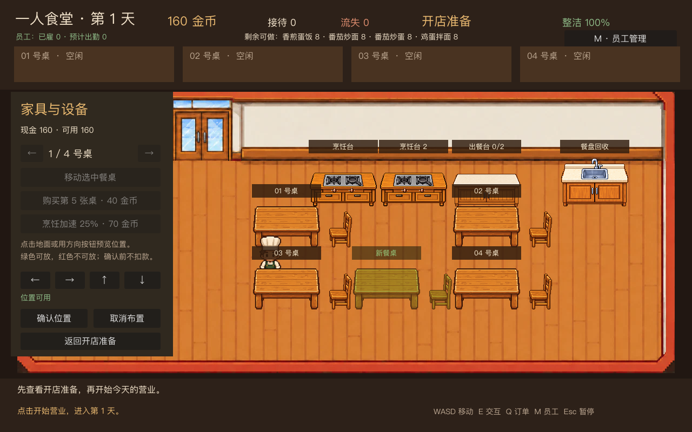
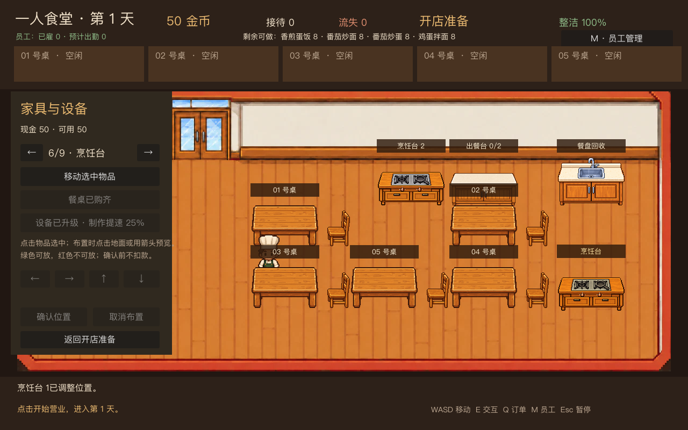

# 阶段 4.5：家具与设备

开店准备时点击“家具设备”，可直接点击物品，或用面板左右按钮选中任意现有餐桌、两处烹饪台、出餐台或餐盘回收台。餐桌与座椅成组移动。每张新餐桌花费 40 金币，没有写死的购买数量上限；只要有钱且布局中仍有可达的摆放位置，就能继续购买。进入布置后，点击餐厅地面或使用面板上的方向按钮调整半透明预览；绿色表示可放，红色表示与其他物品重叠、越界或阻断必要通路。点击“确认位置”才会生效；移动免费，购买餐桌在确认时付款。“取消布置”会恢复原状。营业期间不能更改布局。

新餐桌有独立的订单，顶部每页展示五张桌的订单卡，可用两侧箭头翻页；按 Q 选中订单时会自动切到该桌所在页。顾客会沿当前布局的可通行地面走到座位。设备移动后，主角和员工会在新位置做菜、取餐或回收餐盘。每次确认布局都会重建员工寻路路线。布局检查包括所有家具和设备的占地、入口至各餐桌和工作台的通路、操作点与座位附近的可达性，以及主角和员工的出发位置。

烹饪设备可花 70 金币升级一次。升级后，主角小游戏和员工自动做菜的制作速度均提高 25%；面板会显示价格与效果。家具和设备使用经营账本分别记账，重复购买不会重复扣款。

餐桌位置、功能设备位置、购买状态和设备升级在当前游戏的跨营业日经营中保留；按“新游戏”会重置。由于按当前开发顺序暂缓 4.4 存档，退出程序后的持久化留待 4.4 实现。

`tests/test_layout_equipment.gd` 覆盖餐桌和四台设备的布置、越界、重叠、可达性、连续购买与升级扣款、第五张桌的顾客到达/上菜/收盘、订单卡翻页、移动后的工作点交互、跨日与重置，以及员工空闲慢速走动和接单。两张图片由 `tests/capture_stage_4_5.gd` 从实际游戏场景生成，均小于 400KB。
